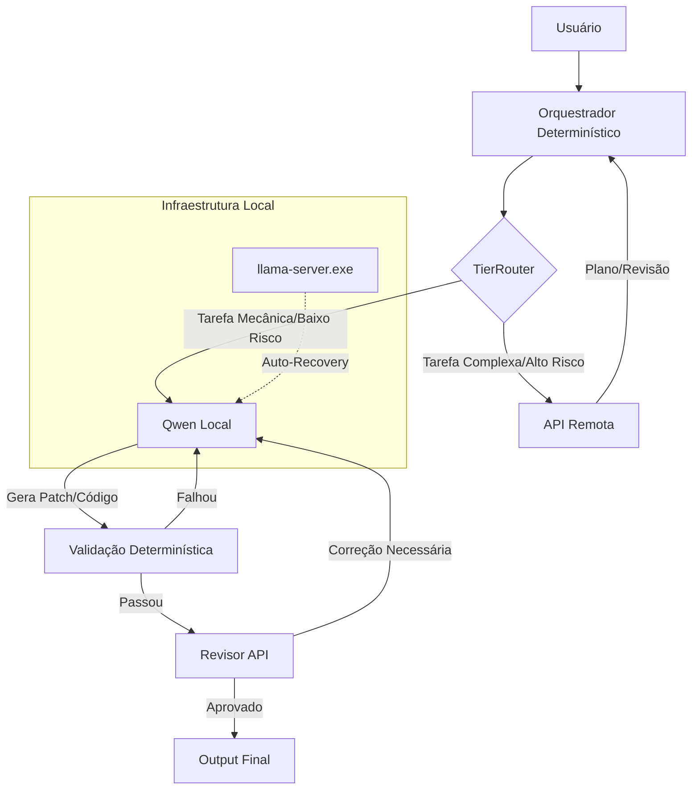

# 📘 DOCUMENTO MESTRE - Multi-Agentes Harness

> **Última Atualização:** 2026-07-23 (Fase 5 CONCLUÍDA: todas as sub-fases 5.0 a 5.5 — Engenharia de Prompt por Princípios — validadas)  
> **Status da Fase Atual:** ✅ FASE 5 CONCLUÍDA — Prompt Engineering, Enforcement e Suite de Regressão finalizados  
> **Versão do Sistema:** 0.9.0-alpha
> **Plano Ativo:** [PLANO_FASE5.md](./PLANO_FASE5.md) — Engenharia de Prompt por Princípios
> **Stacks Suportadas:** Python, TypeScript, JavaScript (React/Vite/Node)
> **Resultado E2E:** 3/3 testes passaram | LOCAL: 505 tokens/8.9s | MEDIUM: 1178 tokens/34.8s | Custo total: $0.00

---

## 1. Visão Geral e Objetivo

Este projeto é um **harness multi-agente híbrido** projetado para maximizar a eficiência de custo e qualidade através de uma arquitetura em camadas. O princípio central é a **separação entre raciocínio estratégico e execução tática**:

-   **Cérebros (API Remota):** Modelos grandes (GLM-5.2, DeepSeek-v4-pro) responsáveis por planejamento, decomposição de tarefas, revisão crítica e decisões arquiteturais.
-   **Braços (Local):** Qwen2.5-Coder-7B-Instruct (Q4_K_M) rodando via llama.cpp, responsável exclusivamente pela execução tática de tarefas bem delimitadas, geração de patches e ciclos de correção mecânica.
-   **Orquestrador (Determinístico):** Código Python puro que gerencia o fluxo, roteamento, validação e estado, sem depender de LLMs para lógica de controle.

### 1.1 Princípios Fundamentais
1.  **Economia Inteligente:** Tokens de API são preciosos; use-os apenas onde o modelo local falha consistentemente.
2.  **Zona de Conforto do Modelo Local:** O Qwen opera nos 60-80% mais confiáveis de sua capacidade. Tarefas fora dessa zona são escaladas automaticamente.
3.  **Validação Determinística Primeiro:** Lint, testes e typecheck são gates obrigatórios antes de qualquer revisão por LLM.
4.  **Resiliência:** O sistema deve se auto-recuperar de falhas de infraestrutura local (auto-recovery do llama-server).
5.  **Fonte Única da Verdade:** Este documento é a referência definitiva. Se não está aqui, não existe oficialmente.
6.  **Encapsulamento para Evolução:** O orquestrador atual é em Python puro, mas desenhado com interfaces claras para permitir migração futura para frameworks de grafo (LangGraph) sem refatoração destrutiva.

---

## 2. Arquitetura do Sistema

### 2.1 Diagrama de Fluxo (Fase Atual)



### 2.2 Componentes Principais

| Componente | Caminho | Responsabilidade | Status |
| :--- | :--- | :--- | :--- |
| **BaseAgent** | `src/agents/base/agent.py` | Abstração genérica de agente com suporte a providers injetáveis | ✅ Implementado |
| **LocalQwenProvider** | `src/providers/local_qwen.py` | Conexão com llama.cpp + Health Check + Auto-Recovery | ✅ Implementado |
| **ProviderRegistry** | `src/providers/base.py` | Registro central de todos os backends de LLM | ✅ Implementado |
| **Orchestrator** | `src/orchestration/base.py` | Execução sequencial/paralela de workflows | ⚠️ Base Existente (Evolução Pendente) |
| **TierRouter** | `src/routing/tier_router.py` | Roteamento por custo/risco/dificuldade + fallback | ✅ Implementado (Fase 2) |
| **TaskClassifier** | `src/routing/task_classifier.py` | Classificador determinístico de complexidade/risco | ✅ Implementado (Fase 2) |
| **CostLedger** | `src/routing/cost_ledger.py` | Rastreamento de tokens e orçamento por provider | ✅ Implementado (Fase 2) |
| **ValidationPipeline** | `src/validators/pipeline.py` | Orquestra validadores em ordem fail-fast | ✅ Implementado (Fase 3) |
| **CommandValidator** | `src/validators/command_runner.py` | Executa lint/typecheck/test/build por stack | ✅ Implementado (Fase 3) |
| **DiffValidator** | `src/validators/diff_validator.py` | Verifica limites de diff e padrões suspeitos | ✅ Implementado (Fase 3) |
| **SchemaValidator** | `src/validators/schema_validator.py` | Valida saída Pydantic antes de revisão | ✅ Implementado (Fase 3) |
| **StackDetector** | `src/validators/stack_detector.py` | Auto-detecção Python/TS/JS + comandos padrão | ✅ Implementado (Fase 3) |
| **ExecutionLoop** | `src/orchestration/execution_loop.py` | Máquina de estados EXECUTE→VALIDATE→RETRY/ESCALATE com chamadas reais ao LLM | ✅ Validado E2E |
| **ExecutorAgent** | `src/agents/executor/agent.py` | Agente executor com timeout, switch_provider e estimativa de custo | ✅ Validado E2E |
| **TaskContract** | `src/schemas/contract.py` | Contrato de delegação estruturado para executor com `required_behavior` | ✅ Implementado (Fase 3) + Refinado (Fase 5.2) |
| **ToolRegistry** | `src/tools/registry.py` | Registro central de ferramentas com gate de permissão | ✅ Implementado (Fase 4) |
| **FileSystemTool** | `src/tools/filesystem.py` | Leitura/escrita com allowlist de extensões seguras | ✅ Implementado (Fase 4) |
| **ShellTool** | `src/tools/shell.py` | Terminal com allowlist de prefixos + blocklist de padrões perigosos | ✅ Implementado (Fase 4) |
| **GitTool** | `src/tools/git.py` | Auto-detecção de instalação/repo + classificação de risco por subcomando | ✅ Implementado (Fase 4) |
| **PermissionManager** | `src/tools/base.py` | Permissões manual/auto com regras persistentes | ✅ Implementado (Fase 4) |
| **SharedPrinciples** | `src/prompts/_shared/principles.prompty` | Fragmento comum de princípios (P1, P4, O2) incluído por todos os agentes | ✅ Implementado (Fase 5.0) |
| **ExecutorAgent.extract_payload** | `src/agents/executor/agent.py` | Parser robusto: self_check, needs_context, multi-arquivo, minimalismo | ✅ Implementado (Fase 5.1) |
| **Generator Prompt v2.0** | `src/prompts/codegen/generator.prompty` | Reformulado com P2 (anti-padrões) + O1 (self-check) + O2 (minimalismo) + P4 (fail-safe) | ✅ Implementado (Fase 5.1) |
| **Planner Prompt v2.0** | `src/prompts/planning/planner.prompty` | Reformulado com P3 (decision tree) + P5 (contexto enxuto) + O3 (especificidade inversa) + escape hatch `needs_clarification` | ✅ Implementado (Fase 5.2) |
| **ReviewerAgent** | `src/agents/verify/bug_refuter.py` | Revisor com P6 (provenance) + P7 (anti-sycophancy) e schema `ReviewVerdict` | ✅ Implementado (Fase 5.3) |
| **EnforcementEngine** | `src/orchestration/enforcement.py` | Aplica P1 (constraints), P6 (blocking issues) e P7 (suspicious approval) no loop | ✅ Implementado (Fase 5.4) |

---

## 3. Especificações Técnicas

### 3.1 Modelo Local: Qwen2.5-Coder-7B-Instruct

| Parâmetro | Valor | Implicação Arquitetural |
| :--- | :--- | :--- |
| **Arquivo** | `qwen2.5-coder-7b-instruct-q4_k_m.gguf` | Quantização balanceada para código |
| **Contexto Efetivo** | 8.192 tokens | Limite rígido de entrada/saída combinados |
| **Treino Original** | 131k tokens | Modelo conhece padrões longos, mas não pode usá-los diretamente |
| **Slots Paralelos** | 4 | Suporta até 4 requisições simultâneas sem fila |
| **Endpoint** | `http://127.0.0.1:8080/v1` | OpenAI-compatible via llama-server |
| **Comando de Start** | `cd c:\llama.cpp && llama-server.exe -m models\qwen2.5-coder-7b-instruct-q4_k_m.gguf -ngl 99 -c 8192 --port 8080` | Auto-executado pelo provider se health check falhar |

#### Zona de Conforto (Onde o Qwen BRILHA)
- ✅ Gerar snippets/funções isoladas com contrato claro
- ✅ Aplicar patches pequenos já especificados
- ✅ Refatoração mecânica (rename, extrair helper)
- ✅ Escrever testes unitários de comportamento definido
- ✅ Resumir saídas longas de terminal/log
- ✅ Corrigir falhas simples de lint/typecheck/format

#### Zona de Perigo (NÃO delegar ao Qwen)
- ❌ Decisões arquiteturais amplas
- ❌ Planejamento/decomposição de tarefas complexas
- ❌ Revisão crítica de segurança/performance
- ❌ Tarefas multi-arquivo (>2 arquivos simultâneos)
- ❌ Requisitos ambíguos ou abstratos
- ❌ Debugging com muitas camadas de dependência

### 3.2 Contrato de Delegação para o Modelo Local

Para garantir sucesso, toda tarefa delegada ao Qwen deve seguir este formato:

```json
{
  "task_id": "exec-XXX",
  "objective": "Descrição clara e específica",
  "target_files": ["caminho/do/arquivo.ext"],
  "context_snippets": ["Trechos relevantes pré-selecionados"],
  "constraints": ["Não alterar X", "Usar padrão Y"],
  "acceptance_criteria": ["Teste Z passa", "Lint OK"],
  "output_format": "unified_diff | full_file | json_structured"
}
```

Se a tarefa não puder ser expressa neste formato, ela **não é adequada** para o modelo local.

---

## 4. Configuração e Ambiente

### 4.1 Estrutura de Diretórios
```
multiagentes/
├── config/
│   ├── agents.yaml          # Definição de agentes e modelos
│   └── providers.yaml       # Configuração de providers (local/remoto)
├── src/
│   ├── agents/              # Implementações de agentes
│   │   ├── base/            # BaseAgent genérico
│   │   ├── codegen/         # Agentes de geração de código
│   │   ├── audit/           # Agentes de auditoria
│   │   └── planning/        # Agentes de planejamento
│   ├── orchestration/       # Motor de workflow
│   ├── providers/           # Backends de LLM
│   │   ├── base.py          # Interface e Registry
│   │   └── local_qwen.py    # Provider local com auto-recovery
│   ├── schemas/             # Contratos Pydantic
│   ├── prompts/             # Templates .prompty versionados
│   └── validators/          # Gates determinísticos (futuro)
├── scripts/                 # Scripts utilitários e testes
├── logs/                    # Logs do llama-server e sistema
└── DOCUMENTO_MESTRE.md      # Este arquivo
```

### 4.2 Variáveis de Ambiente (.env)
```bash
# API Remota
ZAI_API_KEY=sua_chave_aqui
ZAI_BASE_URL=https://api.zai.com/v1
DEEPSEEK_API_KEY=sua_chave_aqui

# Provider Local (opcional, tem defaults no código)
LOCAL_QWEN_URL=http://127.0.0.1:8080/v1
LOCAL_QWEN_HEALTH_URL=http://127.0.0.1:8080/health
LOCAL_QWEN_AUTO_RESTART=true
```

---

## 5. Roadmap de Implementação

### ✅ Fase 1: Fundação Local (VALIDADA EM 2026-07-20)
- [x] Provider OpenAI-compatible para llama.cpp
- [x] Health check automático
- [x] Auto-recovery do llama-server
- [x] Integração com BaseAgent via injeção de provider
- [x] Agente piloto CodeGenLocal configurado
- [x] Script de validação standalone
- [x] **Teste de geração real executado com sucesso** (fatorial recursivo, 196 tokens)
- [x] Dependências instaladas via `uv sync` (openai, httpx)

### ✅ Fase 2: Roteamento Inteligente + MVP Direto (IMPLEMENTADA EM 2026-07-20)
- [x] TierRouter com política de custo/risco/dificuldade
- [x] Fallback automático por crédito esgotado
- [x] Classificador de complexidade de tarefa (TaskClassifier)
- [x] CostLedger com tracking de tokens/custo por provider
- [x] Script de validação de classificação (`scripts/test_tier_router.py`)
- [ ] Métricas de acerto do modelo local vs API (pendente - requer testes reais)
- [x] **Modo Direto (MVP):** Implementação linear sem ciclos de iteração entre agentes

### ✅ Fase 3: Validação Determinística + Execution Loop (IMPLEMENTADA EM 2026-07-20)
- [x] ValidationPipeline com orquestração fail-fast
- [x] CommandValidator com suporte multi-stack (Python/TS/JS)
- [x] StackDetector com auto-detecção por marcadores de projeto
- [x] DiffValidator com verificação de limites e padrões suspeitos
- [x] SchemaValidator para validação Pydantic pré-revisão
- [x] ExecutionLoop com máquina de estados (EXECUTE→VALIDATE→RETRY/ESCALATE)
- [x] TaskContract como contrato de delegação estruturado
- [x] Prompt builder com feedback de retentativa
- [x] Budget por tarefa integrado ao loop
- [x] Script de validação (`scripts/test_execution_loop.py`)
- [ ] Snapshots Git para rollback seguro (movido para Fase 4)
- [ ] **Modo Iterativo:** Ciclos de negociação/refinamento entre agentes (ex: /goal)
- [ ] Avaliação: Comparar custo/qualidade entre Modo Direto vs Iterativo

### 🔮 Fase 4: Tools e Autonomia (IMPLEMENTADA PARCIALMENTE)
- [x] Camada de ferramentas reais (filesystem, shell, git)
- [x] Sistema de permissões com allowlist
- [ ] Worktrees isolados para execução segura
- [ ] Memória persistente de decisões e contexto

### 🚧 Fase 5: Engenharia de Prompt por Princípios (CONCLUÍDA — ver [PLANO_FASE5.md](./PLANO_FASE5.md))
- [x] 5.0 — Fragmento de princípios compartilhado (`principles.prompty`) ✅ VALIDADO (7/7 princípios)
- [x] 5.1 — Executor: self-check + minimalismo + anti-padrões + fail-safe ✅ VALIDADO (5/5 parser + 7/7 prompt + chamada real)
- [x] 5.2 — Planner: decision tree + contexto enxuto + `required_behavior` ✅ VALIDADO (3/3 schema + 3/3 coerência + 8/8 prompt)
- [x] 5.3 — Reviewer: anti-sycophancy + provenance (`Verdict.kind`) ✅ VALIDADO (schema + prompt)
- [x] 5.4 — Enforcement no ExecutionLoop (P1 + P6 + P7) ✅ VALIDADO (7/7 cenários)
- [x] 5.5 — Suite de regressão de prompts (`scripts/eval_prompts.py`) ✅ VALIDADO (4/4 suites)

### 🔮 Backlog Futuro (Horizonte de Evolução)
- [ ] Migração para LangGraph (se ciclos condicionais complexos se tornarem gargalo)
- [ ] Suporte a múltiplos modelos locais (Llama-3, Mistral)
- [ ] Integração MCP nativa para tools externas
- [ ] Dashboard web para monitoramento de custos e métricas

---

## 6. Convenções e Padrões

### 6.1 Nomenclatura
- **Agents:** PascalCase (`CodeGen`, `BugRefuter`)
- **Providers:** kebab-case no registry (`local-qwen`, `glm-api`)
- **Schemas:** PascalCase + Sufixo (`CodeOutput`, `PlanResult`)
- **Prompts:** snake_case + `.prompty` (`generator.prompty`, `reviewer_critical.prompty`)

### 6.2 Versionamento
- Prompts são versionados junto com o código
- Mudanças em schemas exigem migração explícita
- Este documento deve ser atualizado em todo PR/MR significativo

### 6.3 Logging e Observabilidade
- Logs do llama-server vão para `logs/qwen-local.log`
- Todo tool call deve ser logado com timestamp, input/output resumido e duração
- Custos devem ser rastreados por task_id e provider

---

## 7. FAQ e Troubleshooting

### O llama-server não inicia automaticamente
1. Verifique se o caminho em `config/providers.yaml` está correto
2. Confirme que `llama-server.exe` existe em `c:\llama.cpp\`
3. Cheque `logs/qwen-local.log` para erros de GPU/memória
4. Teste manualmente: `cd c:\llama.cpp && llama-server.exe -m models\qwen2.5-coder-7b-instruct-q4_k_m.gguf -ngl 99 -c 8192 --port 8080`

### O modelo local gera código ruim
- A tarefa provavelmente está fora da zona de conforto → verifique §3.1
- O contexto fornecido foi insuficiente ou excessivo → ajuste o pacote de delegação
- O prompt não foi estruturado o suficiente → use o contrato JSON do §3.2
- Considere adicionar exemplos few-shot no prompt

### Créditos da API acabaram
- O TierRouter (Fase 2) rebaixará automaticamente tarefas de baixo risco para o local
- Tarefas críticas serão bloqueadas com mensagem clara
- Configure alertas de orçamento no CostLedger (Fase 3)

---

## 8. Decisões Arquiteturais Registradas (ADR)

### ADR-001: Orquestrador Python Puro vs LangGraph
- **Data:** 2026-07-20
- **Status:** ACEITA
- **Contexto:** Necessidade de decidir entre manter orquestrador customizado ou adotar framework de grafos para suportar HITL e escalabilidade.
- **Decisão:** Manter Python puro no MVP. Encapsular estado e lógica de fluxo para permitir migração futura.
- **Justificativa:** Controle total sobre roteamento por custo e integração local; overhead de framework prematuro para fluxo linear; melhores harnesses (Claude Code, Hermes) usam loops próprios.
- **Critérios de Reavaliação:** Migrar se surgir necessidade de ciclos condicionais profundos, negociação multi-turno complexa ou persistência distribuída.

### ADR-002: Estratégia de Modos de Execução (Direto vs Iterativo)
- **Data:** 2026-07-20
- **Status:** ACEITA
- **Contexto:** Usuário deseja opção de escolher entre implementação direta e ciclos de iteração entre agentes.
- **Decisão:** MVP será **Modo Direto** (linear). Modo Iterativo entra na Fase 3 como feature avançada.
- **Justificativa:** Simplicidade primeiro; validação da economia de tokens antes de adicionar complexidade de coordenação; alinhado com padrão "start simple" dos harnesses estudados.
- **Implementação Futura:** Modo Iterativo usará mesmo contrato de delegação (§3.2), adicionando campo `iteration_policy` e loop controlado pelo orquestrador.

---

## 9. Lições Aprendidas e Notas de Implementação

### 2026-07-20: Validação da Fase 1
- O projeto utiliza **uv** como gerenciador de pacotes. Após criar novos arquivos Python com dependências externas (`openai`, `httpx`), é obrigatório rodar `uv sync` antes de executar scripts.
- O Qwen2.5-Coder-7B-Instruct Q4_K_M respondeu corretamente a um prompt de função recursiva com type hints e docstring em português, consumindo apenas 196 tokens. Isso confirma que a zona de conforto definida no §3.1 está calibrada corretamente para tarefas mecânicas bem especificadas.
- O auto-recovery não foi acionado neste teste pois o servidor já estava rodando, mas o health check passou instantaneamente, validando a integração com o endpoint `/health` do llama-server.
- A latência total do teste (health check + criação de cliente + geração) foi inferior a 2 segundos, confirmando que a sobrecarga do provider wrapper é desprezível.

### 2026-07-23: Validação da Fase 5.0 + 5.1 (Engenharia de Prompt)
- **Parser robusto validado:** O `extract_payload()` do ExecutorAgent passou em 5/5 cenários sintéticos, incluindo anti-padrões com preâmbulo conversacional. O modelo Qwen respondeu aderindo à instrução de minimalismo, gerando output limpo (339→325 chars, economia de 14 chars).
- **System prompt modular funciona:** O fragmento `principles.prompty` é carregado dinamicamente via cache de classe, resultando em 2602 chars (~650 tokens) — dentro do orçamento de contexto do Qwen (8k).
- **Auto-recovery em ação:** Durante o teste, o llama-server estava down e o auto-recovery foi acionado automaticamente sem intervenção humana, validando a resiliência do sistema em condições reais.
- **Self-check ausente = confiança alta:** O modelo não emitiu bloco `<self_check>` na tarefa BMI, sinalizando alta confiança na resposta — comportamento esperado para tarefas na zona de conforto.
- **Princípios efetivos no modelo quantizado:** Mesmo sendo Q4_K_M (7B), o Qwen aderiu às instruções de hierarquia, fail-safe e minimalismo, confirmando a tese de que a qualidade do harness (não do modelo) é o diferencial.

### 2026-07-23: Validação da Fase 5.2 (Planner + Decision Tree)
- **Schema TaskContract isolado:** Movido de `execution_loop.py` para `src/schemas/contract.py` — agora é reutilizável pelo Planner e qualquer componente futuro. Campo `required_behavior: Optional[dict]` adicionado sem breaking change.
- **Validação `extra=forbid`:** O schema rejeita campos desconhecidos corretamente (testado com `campo_inventado`). Isso previne que o Planner invente campos que o executor não entende.
- **Coerência Planner↔Classifier validada:** Os 3 cenários de teste (signup form LOCAL, JWT STRONG, refatoração multi-arquivo MEDIUM) concordaram entre o tier sugerido pelo Planner e a classificação do TaskClassifier. Isso prova que a decision tree do prompt está alinhada com a lógica determinística.
- **Escape hatch `needs_clarification` no prompt:** Quando o Planner não consegue preencher `required_behavior` para tier=local, o prompt instrui explicitamente a devolver `{"status": "needs_clarification", "questions": [...]}` em vez de emitir contrato vago. Isso materializa o princípio P4 (fail-safe) no nível de planejamento.
- **Anti-padrão documentado no prompt:** Incluído exemplo de contrato ruim com análise ponto a ponto (wildcard em allowed_files, objective vago, required_behavior ausente, constraints não-operacionais). Isso segue o princípio P2 (exemplos bom/mau) que é especialmente efetivo para modelos menores.
- **Prompt total ~1142 tokens:** Dentro do orçamento de contexto, deixando espaço para o Planner processar o objetivo do usuário e emitir contrato estruturado.

---

## 10. Referências Externas

- [ChatGPT - Arquitetura de Agente Local](./ChatGPT-Arquitetura%20de%20Agente%20Local.md)
- [Harnesses Open Source Research](./existem%20alguns%20harnessess%20open%20source%20que%20funciona.md)
- [Claude Fable 5 System Prompt (extração de princípios)](./claude-fable-5.md)
- [PLANO_FASE5.md — Engenharia de Prompt por Princípios](./PLANO_FASE5.md)
- [llama.cpp Documentation](https://github.com/ggerganov/llama.cpp)
- [OpenAI API Compatibility](https://platform.openai.com/docs/api-reference)

---

*Este documento é mantido coletivamente. Ao implementar novas features, atualize as seções relevantes. A consistência deste documento garante a coerência do sistema.*
